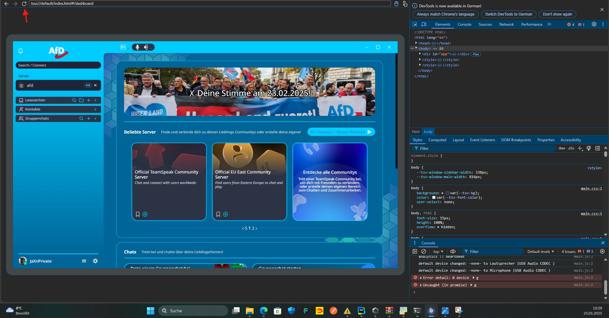

[](https://github.com/Gamer08YT/AFD-TeamSpeak6-Theme/actions/workflows/release-zip.yml)

# TeamSpeak6 AFD Theme

(This Theme is for test purposes only, it's no production theme)

[Downloads](https://github.com/Gamer08YT/AFD-TeamSpeak6-Theme/releases)


### Deutsch

Für alle blauen Schlümpfe, die noch TeamSpeak benutzen, ein AFD-Theme für das „neue“ TeamSpeak6.

Beiträge am Code sind erwünscht.

Wir haben versucht, uns an die [AFD-Branding-Richtlinien](https://www.afd.de/erscheinungsbild/) für das Theme zu halten.

#### So öffnen Sie die Entwicklungswerkzeuge:

Sie müssen TeamSpeak mit dem Remote Debugging Port Argument starten, zum Beispiel:

``„C:\Program Files\TeamSpeak\TeamSpeak.exe“ --remote-debugging-port=9222``

Dann können Sie folgenden Link in Ihrem Browser öffnen:

[Devtools JSON](http://localhost:9222/json)

Kopieren Sie die folgende URL und setzen Sie sie hinter ``http://localhost:9222``:


Nun können Sie die Dev Tools verwenden, um die HTML-Struktur zu überprüfen und den Client neu zu laden.



### English

For all blue Smurfs who still use TeamSpeak, an AFD theme for the “new” TeamSpeak6.

Contributions to the code are welcome.

We have tried to adhere to the [AFD branding guidelines](https://www.afd.de/erscheinungsbild/) for the theme.

#### How to open Dev Tools:

You need to start TeamSpeak with the Remote Debugging Port Argument, for Example:

```"C:\Program Files\TeamSpeak\TeamSpeak.exe" --remote-debugging-port=9222```

Then you can open following Link in your Browser:

[Devtools JSON](http://localhost:9222/json)

Copy following URL and put it behind ```http://localhost:9222```:


Now you can use the Dev Tools to inspect the HTML Structure and reload the Client.


